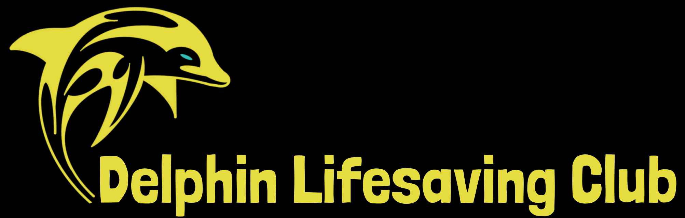
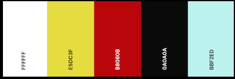
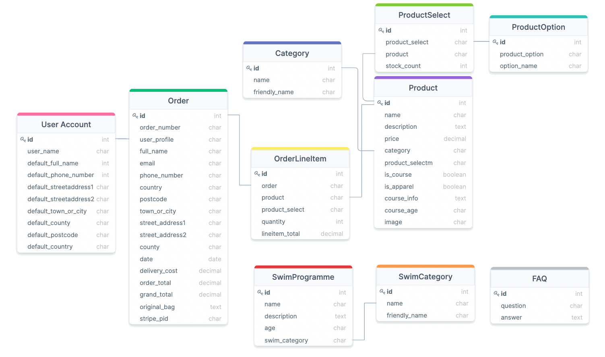

<div style="margin:auto">

</div>

<div style="text-align:center">
<p>The <strong>Delphin Lifesaving Club</strong> e-shop was designed, built and deployed by Rebecca Tracey-Timoney as the fourth and final Milestone Project to be completed for the duel Software Development Diploma from The Code Institute and UCD. The purpose of this online shop is to provide a virtual shopping environment for club members (future and current) to browse and purchase Delphin products, including classes and club apparel. The website provides a smooth and uncomplicated online shopping experience for users, with its simplistic and intuitive design.</p>

[View the live project here](https://delphin-lifesavingclub.herokuapp.com/ "Link to Delphin page")
<hr>
</div>

### Table of contents
1. [UX](#UX)
     1. [Project Goals](#Project-Goals)
     2. [User Stories](#User-Stories)
     3. [Development Planes](#Development-Planes)
2. [Information Architecture](#Information-Architecture)
     1. [Database](#Database)
     2. [Data Models](#Data-Models)
3. [Features](#Features)
     1. [Design Features](#Design-Features) 
     2. [Existing Features](#Existing-Features)
     3. [Features to Implement in the future](#Features-to-Implement-in-the-future)
4. [Issues and Bugs](#Issues-and-Bugs)
5. [Technologies Used](#Technologies-Used)
6. [Testing](#Testing) ☞ **[Testing.md](TESTING.md)**
7. [Deployment](#Deployment)
8. [Credits](#Credits)
9. [Acknowledgements](#Acknowledgements)
***

<div style="text-align:center">

</div>

***

## UX 
### Project Goals
#### User Goals
The User is looking to:
- Securely purchase available Club course credits
- Securely purchase club apparel
- Contact the Delphin Team
- Learn about the club (for prospective members)
- Navigate through the online store with ease  
#### Developer / Site Owner Goals
The Developer is looking to:
- Provide and professional and trustworthy webshop, helping users to meet their goals.
- Reach a wider audience of prospective members through online intergration, making it easier to get involved.
- Provide a seamless process, allowing swimmers to pre-purchase lesson credits, prior to registration, avoiding unnecessary waiting times on location.
- Showcase the variety of lessons that Delphin provides.
- Showcase the Club's apparel collection
- Demonstrate their proficiency in a variety of software development skills, using newly learned languages and libraries as well as a document database system.
- Deploy a project they are proud of, and excited to have, on their portfolio.

### User Stories

**As a user, I want to:**

1. View all products, to purchase my desired items.
2. Filter through categories, to only see relevant products.
3. Use a search query, to find a specific product or product type.
4. Add items to my shopping bag, to begin the order process.
5. Receive visual feedback that my item has been added to the bag, to confirm my selection.
6. Select a course on a specific day, to suit my needs.
7. Select apparel in a specific size, to suit my needs.
8. View contact information for the club, to communicate with team.
9. Connect with the club on one of their social apps, to communicate with the team.
10. Get a breakdown of classes offered, to find one that suits my needs.
11. Navigate to a page that could help me with my enquiry, to answer my question.

**As a new visitor, I want to:**

1. View the club's Academy programme, to ascertain if the club is right fit.
2. Create an account, to unlock registered user features.

**As a returning visitor, I want to:**

1. Easily log into my existing account, to unlock registered user features.
2. View my previous orders, to keep a record of my transaction.
3. Save default information, to save time for future orders.
4. Edit default information, to update any necessary fields. 
5. View shopping bag to get an overview of products I wish to order.
6. Remove products from my bag, to suit my needs.
7. Update a product's quantity, to suit my needs.
8. Get real-time feedback on available stock, to make purchase decisions.
8. Proceed to a secure checkout, to make a purchase.
9. Have clear visual feedback of the order process, to understand all steps of the process.
10. Be able to edit my bag at all times, to allow change of mind.
11. Receive a summary of my order via email to confirm that my transaction has been process.

### Development Planes

In order to design and create the application, the developer distinguished the required functionality of the site and how it would answer the user stories, as described above, using the **Five Development Planes**:

<strong>1. <u>Strategy</u></strong>

Broken into three categories, the website will focus on the following target audiences:
- **Roles:**
     - New Swimmers
     - Current Swimmers
     - Parents/Guardians of Swimmers

- **Demographic:**
     - Aged 16+ (to make a purchase)
     - Dublin (or neighbouring counties) resident
     - Active/Sporty
     - Swimming/Lifesaving Orientated

- **Psychographics:**
     - Personality & Attitudes:
          - Sporty
          - Outgoing
          - Team Orientated
     - Values:
          - Friendship
          - Community
          - Activeness
     - Lifestyles:
          - Sporty
          - Team Player
          - Outgoing

The website needs to enable the **user** to:
- Create an account or log in to an existing one
- Purchase a course
- Purchase Club Apparel
- View past purchases
- Edit/Save Delivery Information
- Find out more about the club:
    - Academy Programme
    - General Questions
- Get in contact:
    - WhatsApp
    - Facebook
    - Email(mailto)
    - Phone
    - Contact Form

The website needs to enable the **client** to:
- Display all available course
- Provide a virtual shop for Club Apparel
- Provide club information:
    - Academy Programme
    - General Questions
- Provide a point of contact:
    - WhatsApp
    - Facebook
    - Email(mailto)
    - Phone
    - Contact Form

With these goals in mind, a strategy table was created to determine the trade-off between importance and viability with the following results:

<div style="margin:auto; width:400px">

</div>

<strong>2. <u>Scope</u></strong>

A scope was defined to identify what needed to be done in order to align features with the strategy previously defined. This was broken into two categories:
- **Content Requirements**
     - The user will be looking for:
        - Product Information:
            - Name
            - Description
            - Image
            - Size (where applicable)
            - Day (where applicable)
        - Contact Information:
            - WhatsApp
            - Facebook
            - Email(mailto)
            - Phone Number
            - Contact Form
        - Academy Programme
        - General Questions
        - Create/Login to Profile
            - Save default information
            - View Previous Orders
        - Thematic Imagery and Typography
            - Club logo and colours
            - Typography matching club aesthetic

- **Functionality Requirements**
     - The user will be able to:
        - Search Products
            - Courses:
                - By Age
            - Apparel
                - By Type
        - Make Transactions
        - Sign Up / Login to profile
            - Edit Profile information
            - View Previous orders
            - View shopping bag
        - Interact with shopping bag
            - Add to bag
            - Review bag contents
            - Update bag contents (increase quantity)
            - Remove from bag
        - Read the Academy Programme
        - Find answers to frequent questions

<strong>3. <u>Structure</u></strong>

The website's navigation was organized in order to ensure that users could navigate through the site with ease and efficiency, with the following results: 


<div style="margin:auto; width:90%">
<strong>Navigation Structure for User Management:</strong>

</div>

<div style="margin:auto; width:90%">
<strong>Navigation Structure for Product Management:</strong>

</div>

<div style="margin:auto; width:90%">
<strong>Navigation Structure for Transaction Management:</strong>

</div>

<strong>4. <u>Skeleton</u></strong>

Wireframe mockups were created in a [Figma Workspace](https://www.figma.com/file/Hx5A1pBFoMZs2BYT781Te6/Delphin "Link to Delphin Workspace") with providing a positive user experience in mind:


<strong>5. <u>Surface</u></strong>


- <strong>Colour Scheme</strong>

     - The chosen colour scheme was specifically selected to match the club colours. They are representitive of Lifesaving equipment used, such as flags and lifebuoys.

     - The red colour is specific to Lifeguarding and is used to highlight anything Lifeguarding related.

     - The Blus is an accent colour used in the club logo and beyond for colour contrast.

<div style="margin:auto; width:90%; border:2px solid black">

</div>


- <strong>Typography</strong>

     - The primary font chosen is [Lato](https://fonts.google.com/specimen/Lato "Link to Lato Google Fonts page"). A humanist sans-serif typeface, Lato is semi-rounded with a structured, but friendly warmth.


     - The Secondary font (accent font) chosen is [Londrina Solid](https://fonts.google.com/specimen/Londrina+Solid "Link to Londrina Solid Google Fonts page"). A newfolk typeface, with a rough, handwritten feel, for versatile screen display.


     - The secondary font is an updated version of the font used in the club's typography for logo and official letters. The font is paired well with the primary font, in order provide a minimally contrasting font combination serving as a practical and professional typeface with a hint of playfulness. This highlights the club's character for being professional, yet friendly, setting the tone for new and unfamiliar vistiors.

<div style="margin:auto; width:90%; border:2px solid black">


</div>

- <strong>Imagery</strong>

     - The imagery used was created by the developer using the application [Procreate](https://procreate.art/ "Link to Procreate") in order to create a consistency of the elements while maintaining the look and feel of the application.

     - The product imagery used digital renderings and, where permitted, the developer edited them to display the Club imagery and colour scheme. A complete list of credits can be found in a separate file [here](image_credits.md).

[Back to top ⇧](#table-of-contents)
***

## Information Architecture
### Database
- During development, a single-database was setup using [SQLite](https://www.sqlite.org/index.html "Link to SQLite site") as this is included and did not require any further installation to support.
- Upon deployment, [Heroku Postgres](https://www.heroku.com/postgres "Link to Heroku Postgres site") was used, as this is an add-on service provided by Heroku.

### Data Models

<div style="margin:auto; width:90%; border:2px solid black; background-color:#E9F5F5">

</div>

*model diagram created using [DrawSQL](https://drawsql.app/ "DrawSQL page")*

A full list of the data models used on the site are below:

#### `User Model`

| Name      | Database Key  | Field Type | Type Validation |
|--------------|--------------|--------------|--------------|
| User    | user | OneToOneField(User) | on_delete=models.CASCADE |
| Full Name | default_full_name | Charfield | max_length=50,<br /> null=True,<br /> blank=True|
| Phone Number | default_phone_number | Charfield | max_length=20,<br /> null=True,<br /> blank=True|
| Street Address 1 | default_street_address1 | Charfield | max_length=80,<br /> null=True,<br /> blank=True|
| Street Address 2 | default_street_address2 | Charfield | max_length=80,<br /> null=True,<br /> blank=True|
| Town Or City | default_town_or_city | Charfield | max_length=40,<br /> null=True,<br /> blank=True|
| County | default_county | Charfield | max_length=80,<br /> null=True,<br /> blank=True|
| Postcode | default_postcode | Charfield | max_length=20,<br /> null=True,<br /> blank=True|
| Country | default_country | CountryField | blank_label='Country',<br /> null=True,<br /> blank=True|

#### Users App
A custom User model was created using [Django AllAuth](https://django-allauth.readthedocs.io/en/latest/index.html "Link to Allauth Docs") to ensure secure functionalty of user registration and authentication.

##### `UserProfile` Model
| Name      | Database Key  | Field Type | Type Validation |
|--------------|--------------|--------------|--------------|
| User | user | OneToOneField(User) | on_delete=models.CASCADE |
| Full Name | default_full_name | Charfield | max_length=50,<br /> null=True,<br /> blank=True|
| Phone Number | default_phone_number | Charfield | max_length=20,<br /> null=True,<br /> blank=True|
| Street Address 1 | default_street_address1 | Charfield | max_length=80,<br /> null=True,<br /> blank=True|
| Street Address 2 | default_street_address2 | Charfield | max_length=80,<br /> null=True,<br /> blank=True|
| Town Or City | default_town_or_city | Charfield | max_length=40,<br /> null=True,<br /> blank=True|
| County | default_county | Charfield | max_length=80,<br /> null=True,<br /> blank=True|
| Postcode | default_postcode | Charfield | max_length=20,<br /> null=True,<br /> blank=True|
| Country | default_country | CountryField | blank_label='Country',<br /> null=True,<br /> blank=True|

#### Shop App

##### `Category` Model
| Name      | Database Key  | Field Type | Type Validation |
|--------------|--------------|--------------|--------------|
| Programmable Name | name | charfield | max_length=254 |
| Friendly Name | friendly_name | Charfield | max_length=254 |

##### `ProductOption` Model
| Name      | Database Key  | Field Type | Type Validation |
|--------------|--------------|--------------|--------------|
| Programmable Name | product_option | charfield | max_length=255 |
| Friendly Name | option_name | Charfield | max_length=255, <br /> default='Monday' |

##### `Product` Model
| Name      | Database Key  | Field Type | Type Validation |
|--------------|--------------|--------------|--------------|
| Product Name | name | charfield | max_length=254 |
| Description | description | Textfield | default='test' |
| Price | price | Decimalfield | max_digits=6,<br /> decimal_places=2 |
| Category | category | ForeignKey(Category) | null=True,<br /> blank=True,<br/> on_delete=models.SET_NULL |
| Product Select | product_select | ManyToManyField(ProductOption) | through='ProductSelect',<br /> related_name='product_options',<br /> blank=True |
| Course Check | is_course | Boolean | default=False,<br /> null=True,<br /> blank=True |
| Apparel Check | is_apparel | Boolean | default=False,<br /> null=True,<br /> blank=True |
| Course Information | course_info| TestField | default='Test',<br /> null=True,<br /> blank=True |
| Course Age Range | course_age | CharField | max_length=255,<br /> default='10 years' |
| Image | image | Imagefield | null=True,<br /> blank=True |

> (***`course_info` and `course_age` were used to create unique modals for each course page, providing users with further information on each course, avoidin page over-crowding or unecessary linking to other pages.***)


##### `ProductSelect` Model
| Name      | Database Key  | Field Type | Type Validation |
|--------------|--------------|--------------|--------------|
| Selected Product Option | product_select | ForeignKey(ProductOption) | on_delete=models.CASCADE |
| Selected Product | product | ForeignKey(Product) | on_delete=models.CASCADE,<br /> related_name='product_options' |
| Stock Count | stock_count | IntegerField | default=30|

#### Checkout App

##### `Order` Model
| Name      | Database Key  | Field Type | Type Validation |
|--------------|--------------|--------------|--------------|
| Order Number | order_number | Charfield | max_length=32,<br /> null=False,<br /> editable=False|
| User | user_profile | ForeignKey(User) | null=True,<br /> blank=True,<br/> on_delete=models.SET_NULL,<br />r elated='orders' |
| Full Name | full_name | Charfield | max_length=50,<br /> null=False,<br /> blank=False|
| Email Address | email | EmailField | max_length=254,<br /> null=False,<br/> blank=False| 
| Phone Number | phone_number | Charfield | max_length=20,<br /> null=False,<br /> blank=False|
| Street Address 1 | street_address1 | Charfield | max_length=80,<br />null=False,<br /> blank=False|
| Street Address 2 | street_address2 | Charfield | max_length=80,<br /> null=True,<br /> blank=True|
| Town Or City | town_or_city | Charfield | max_length=40,<br /> null=False,<br /> blank=False|
| County | county | Charfield | max_length=80,<br /> null=False,<br /> blank=False|
| Postcode | postcode | Charfield | max_length=20,<br /> null=False,<br /> blank=False|
| Country | country | CountryField | blank_label='Country*',<br /> null=False,<br /> blank=False|
| Order Date | date | DateField | auto_now_add=True |
| Delivery Cost | delivery_cost | DecimalField | max_digits=6,<br /> decimal_places=2,<br /> null=False,<br /> default=0|
| Order Total | order_total | DecimalField | max_digits=10,<br /> decimal_places=2,<br /> null=False,<br /> default=0|
| Grand Total | grand_total | DecimalField | max_digits=10,<br /> decimal_places=2,<br /> null=False,<br /> default=0|
| Original Bag | original_bag | TextField | null=False,<br /> blank=False,<br /> default=''|
| Stripe Payment Intent ID | stripe_pid | CharField | max_length=254,<br /> null=False,<br /> blank=False,<br /> default=''|

##### `OrderLineItem` Model
| Name      | Database Key  | Field Type | Type Validation |
|--------------|--------------|--------------|--------------|
| Order | order | ForeignKey(Order) | null=False,<br /> blank=False,<br/> on_delete=models.CASCADE,<br /> related_name='lineitems' |
| Product | product | ForeignKey(Product) | null=False,<br /> blank=False,<br/> on_delete=models.CASCADE |
| Selected Product Option | product_select | charfield | max_length=10,<br /> null=False,<br /> blank=False|
| Quantity | quantity | IntegerField | null=False,<br /> blank=False,<br/> default=0 |
| Lineitem Total | lineitem_total | DecimalField | max_digits=6,<br/> decimal_places=2,<br/> null=False,<br /> blank=False,<br/> editable=False |


#### Pages App

##### `SwimCategory` Model
| Name      | Database Key  | Field Type | Type Validation |
|--------------|--------------|--------------|--------------|
| Programmable Name | name | charfield | max_length=254 |
| Friendly Name | friendly_name | Charfield | max_length=254 |

##### `SwimProgramme` Model
| Name      | Database Key  | Field Type | Type Validation |
|--------------|--------------|--------------|--------------|
| Programme Name | name | charfield | max_length=254 |
| Description  | description | Textfield | |
| Age Range | age | charfield | max_length=254 |
| Swim Category | swim_category | ForeignKey(SwimCategory) | null=True,<br /> blank=True,<br/> on_delete=models.SET_NULL |

##### `FAQ` Model
| Name      | Database Key  | Field Type | Type Validation |
|--------------|--------------|--------------|--------------|
| Question | question | charfield | max_length=254 |
| Answer | answer | TextField |  |


[Back to top ⇧](#table-of-contents)
***

## Features

### Design Features
Each page of the websire features a consistently responsive and intuitive naviational system:

#### Navbar
- A **navbar** is conventionally placed on the top of each page, excluding the checkout pages, containing easily identifiable and accessible navigational links with the club logo that redirects users to the home page.
- The navbar utilises **dropdown** menus to provide a clean design, with each link appropriately categorised.
- An **`active`** class provides feedback to users on their current location, through distinguishable differences on active links and their respective category title.
- If the user is in session, an additional dropdown menu provides users with account functionality.
- On mobile and tablet devices, the navigation menu collapses into a conventionally positioned **hamburger** menu, with all navigation links inside.
- The shopping bag is centrally placed on mobile and tablet devices for quick and convenient access to the user's bag.
- **Toasts** are displayed under the navbar, providing users with real-time feedback on their actions.

#### Footer
- The **footer** contains a convenient quick-links area for users to navigate to their preferred location with east
- The links are divided into appropriate categories, allowing users to see the variety of pages the website has. Notably, they also provide a means to categories the Apparel and Courses available, allowing users to find their desired products quicker.
- These links are displayed in three columns on larger devices, two columns and medium and single columns on small.
- The footer also provides the Club **social links** and **copyright** information.
     - Link to Club Facebook page
     - Mailto link to club emails
     - Link to Clubs Whatsapp correspondence number

#### Page Layout

- A banner title is provided on each page to help users to quickly determine their location
- [Jinja](https://jinja.palletsprojects.com/en/3.0.x/ "Link to Jinja docs") was used to extend the base.html page, allowing for the utmost consistency and preservation of functionality across all pages. The extended block elements created the same basic layout for each page:

```
<nav>
     <!-- Navigational content -->
</nav>


     <!-- Appropriate toast messages -->



     <!-- Content unique to each page -->


<footer>
     <!-- Footer content -->
</footer>
```

### Existing Features 

<strong><u>General Pages:</u></strong>

**[Home Page](https://delphin-lifesavingclub.herokuapp.com/ "Link to Home page")**
| Feature      | Description  |
|:--------------:|--------------|
|  Hero Image  | The hero image depicts a pool, clearly defining the website's affiliation and purpose for users (for club interaction) |
| Club Statement and Logo | The club statement and logo are overlayed on the hero image, introducing the club. |
| Duel Links | Links are displayed to provide users quick-link access to product categories. Both images and buttons redirect users to their respective categories. |

**[All Products Page](https://delphin-lifesavingclub.herokuapp.com/shop/ "Link to All Products page")**
| Feature      | Description  |
|:--------------:|--------------|
| Breadcrumbs | Page breadcrumbs allow users to backtrack to the **Home** page |
| Category Filters | Category filters are in place to allow users to refine their search. On mobile and tablet devices this is in a dropdown menu, on larger devices buttons are used. |
| Product Links | All products are displayed on this page, allowing users to select their preference. The product cards provide users with a link from the product image and name to the product details page. |
| Pagination | Pagination displays 12 products per page, avoiding unneccary scrolling. |

**[Apparel Page](https://delphin-lifesavingclub.herokuapp.com/shop/apparel?category=tshirts,jacket_hoodies,accessories,swimwear,swim_accessories "Link to Apparel page") & [Courses Page](https://delphin-lifesavingclub.herokuapp.com/shop/apparel?category=swimming_jnr,swimming_snr,lifesaving,lifeguarding "Link to Courses page")**
| Feature      | Description  |
|:--------------:|--------------|
| Breadcrumbs | Allows users to return to the **All Products** or **Home** page. |
| Sub-Category Filters | Allows users to refine their search to a particular product type (e.g. Apparel type or Course age range) |
| Product Links | The product cards provide users with a link from the product image and name to the product details page. |
| Course Information Modal | Specific to the Courses page, an information modal is displayed on click (represented by an **i** icon), providing information on purchasing a course.|

**[Search Page](https://delphin-lifesavingclub.herokuapp.com/shop/search "Link to Search page")**
| Feature      | Description  |
|:--------------:|--------------|
| Input field | Allowing users to enter their search query, with an appended search button. |
| Category Buttons | Category filters provide users with a convenient quick-link to the categories, in lieu of searching for something. Both images and buttons redirect users to their respective categories. |
| Category Filters | Category filters are in place to allow users to refine their search, directing to their prefered product type page. |
| Dynamic feedback | When a user enters a term, there is dynamic text that displays the number of results returned and their search term. If there are no results, conditional text explains this to the user. |

**[Individual Product Page](https://delphin-lifesavingclub.herokuapp.com/shop/product/1 "Link to Example Product page")**
| Feature      | Description  |
|:--------------:|--------------|
| Breadcrumbs | Allows users to return the category page for that product (Apparel or Courses) or **Home** page. |
| Dropdown Select Menu | Allows users to refine their product selection (sizes of Apparel and times for Courses). Information is provided for stock availabilty for all product selections.|
|Quantity | An input with appending and prepending buttons allows users to alter their quantity selection. This feature is dynamically designed to become inactive if the quantity count is 1 or at the product's stock availabilty. |
| Back Button | Returns users to their previous page, using JavaScript functionality.|
| Add to Bag button | Allows users to add their selection to their shopping bag |

**[Login Page](https://delphin-lifesavingclub.herokuapp.com/accounts/login/ "Link to Login page")**
| Feature      | Description  |
|:--------------:|--------------|
| Input fields | Allows users to enter their username, or email, and password |
| Radio button | Allows users to chose to remember their login details for convenience **(allauth functionality)** |
| Reset Password link | Redirecting users to reset their password **(allauth functionality)** |
| Register button | call-to-action button directing users to signup page |

**[Register Page](https://delphin-lifesavingclub.herokuapp.com/accounts/signup/ "Link to Register page")**
| Feature      | Description  |
|:--------------:|--------------|
| Input fields |  Allows users to enter their information to register an account |
| Signup button | Allows users to create their account **(allauth functionality)**|

**[Club Ethos Page](https://delphin-lifesavingclub.herokuapp.com/pages/ethos "Link to Club Ethos page")**
| Feature      | Description  |
|:--------------:|--------------|
| Call to action links | Links directing users to external pages for clarity purposes. Opens page on new tab. |

**[Academy Programme Page](https://delphin-lifesavingclub.herokuapp.com/pages/swim_programme "Link to Academy Programme page")**
| Feature      | Description  |
|:--------------:|--------------|
| Accordion | An accordion is used for each individual class, with the class name and age range displayed. Clicking the level opens the card and displays information pertaining to that level. |
| Hide/Show Buttons | A `Hide All` and `Show All` button are used to provide users with the capacity to open all cards or close all cards, for convienience. |
| Call to action links | Links directing users to external pages open on new tab, while internal pages are redirect users. |

**[FAQs Page](https://delphin-lifesavingclub.herokuapp.com/pages/faqs "Link to FAQs page")**
| Feature      | Description  |
|:--------------:|--------------|
| Accordion | An accordion is used for each question, with the question displayed. Clicking the question opens the card and displays the answer. |
| Hide/Show Buttons | A `Hide All` and `Show All` button are used to provide users with the capacity to open all cards or close all cards, for convienience. |
| Call to action links | Internal links redirecting users to useful pages within the site. |

**[Contact Page](https://delphin-lifesavingclub.herokuapp.com/pages/contact "Link to Contact page")**
| Feature      | Description  |
|:--------------:|--------------|
| Embeded Google Maps | A Google maps embed was used to provide users with an interactive map, with the pin dropped on the pool location. ([Map reference](https://www.embedgooglemap.net/ "Link to Google Maps Embedding page")) |
| Phone Lin | An anchor link was used for the Membership Officers phone number to provide a convenient quick-link. |
| Mailto action | Three emails are provided using the club email address, with the difference in the subject line to highlight the message for the appropriate officer (for convienience) in order to help the user to send the message quicker. |
| Contact Form | Used for users to conveniently send a message to our Marketing team. Validated using [jQuery Validation](https://jqueryvalidation.org/ "Link to jQuery Validation page").|

<strong><u>Authorised User Pages:</u></strong>

**Shopping Bag Page**
| Feature      | Description  |
|:--------------:|--------------|
| Breadcrumbs | Page breadcrumbs allow users to backtrack to the **Home** page |
| Duel Links | Links are displayed when user's **shopping bag is empty** to provide quick-link access to product categories. Both images and buttons redirect users to their respective categories. |
| Keep Shopping button | Link redirects users to the **All Products** page. Available when at all stages (when bag is both empty and containing items.|
| Remove button | Placed at the top right of each product, allowing users to quickly **remove** the product from the shopping bag. |
|Quantity | An input with appending and prepending buttons allows users to **alter their quantity selection**. This feature is dynamically designed to become inactive if the quantity count is 1 or at the product's stock availabilty. |
| Update button | Updates the bag with the users inputed quantity. |
| Checkout button | Directs users to the **first** page of the checkout process.|

**Order Review Page**
| Feature      | Description  |
|:--------------:|--------------|
| No navbar or footer | This conventionally allows users to **focus on the checkout** process without distractions. |
| Logo Link | Logo at the top of the page **redirects users to the shopping bag** for convienience |
| Heads-up display | This shows the users the steps in the checkout process, giving them **feedback on where they are** and where they are going. |
| Return buttton | Redirects users back to their shopping bag for **editing**. |
| Checkout button | Directs users to the next page of the checkout process.| 

**Order Details Page**
| Feature      | Description  |
|:--------------:|--------------|
| No navbar or footer | This conventionally allows users to focus on the checkout process without distractions. |
| Heads-up display | This shows the users the steps in the checkout process, giving them feedback on where they are and where they are going. Clicking the first number will return them to **to the previous page** |
| Input fields | Allowing users **enter their delivery information** |
| Checkbox button | Allowing users to chose to **save their information** to their profile |
| Order Summary | Providing clear **feedback on bag contents**. On large screens, this is displayed on the right side of the screen. On mobile and tablet devices, this is displayed in a collapsable menu |
| Edit buttton | Redirects users back to their shopping bag for **editing**. |
| Complete Order button | Completes the checkout process.| 

**User Profile Page**
| Feature      | Description  |
|:--------------:|--------------|
| Call to action Buttons | Displayed on the left side of the screen on larger devices and at the end of the page on mobile and tablet devices. Provide users with actions to take on their account, such as change password or emails, as well as logout and redirection to **Past Orders** page.|
| Input fields | Allows users to add or edit their default information to provide them with a faster checkout experience.|
| Update button | Saves new user information with toast used as feedback. |

**Past Orders Page**
| Feature      | Description  |
|:--------------:|--------------|
| Call to action Buttons | Displayed on the left side of the screen on larger devices and at the end of the page on mobile and tablet devices. Provide users with actions to take on their account, such as change password or emails, as well as logout and redirection to **Profile** page.|
| Call to action buttons | User's order history is displayed on the right side of the screen on larger devices and at the top (single column) on smaller screens. It provides a snapshop of order information, including date of purchase, number of items, order total and a call-to-action `View` button allowing them to view the Order Complete page with appropriate conditional text to let them know this is a past order. |

### Features to Implement in the future
- **SwapShop Page**
     - As children tend to grow out of their clothing quickly, a service we are looking into providing is a 'SwapShop' allowing swimmers to trade club gear (excluding swimwear) with others, passing it along to to others when they grow out of it.
     - The devloper looked into implementing this, researching how to set up a virtual noticeboard, but it proved to require a far greater skillset than their current abilities.

- **QR Codes**
     - Another feature that was looked into was providing unique QR codes with every class purchase. 
     - The club is currently looking into implementing this into their registration process, to avoid paperwork methods, and are only in the design stages. 
     - The project time constraint was the deciding factor as the devloper needed to finish the design of the scanning process and learn how to implement it in order to use it.

- **Swimmer Profiles**
     - As the club moves away from paperwork methods, integrating into a more technologically minded system (for GDPR reasons), we would want to expand this webshop into providing a 'Swimmer Profile', allowing swimmers to log in to see their progress week-by-week.
     - Although looked into, the current skillset discouraged the developer to research this feature any further as they did not think they could do it the justice the feature deserves.

[Back to top ⇧](#table-of-contents)
***

## Issues and Bugs 

The developer encountered a number of issues during the development of the website, with the noteworthy ones listed below, along with solutions or ideas to implement in the future.

**Pagination** <br />
In implementing the pagination feature (allowing only 12 products to be displayed on the page at any given time), the developer encountered an issue wherby, when applying pagination on the filtered pages, **[All Apparel](https://delphin-lifesavingclub.herokuapp.com/shop/apparel?category=tshirts,jacket_hoodies,accessories,swimwear,swim_accessories "Link to All Apparel page"), [All Courses](https://delphin-lifesavingclub.herokuapp.com/shop/courses?category=swimming_jnr,swimming_snr,lifesaving,lifeguarding "Link to All Courses page") and [Search](https://delphin-lifesavingclub.herokuapp.com/shop/search "Link to Search page")**, the feature would reset the filters set (e.g. the product categories) from the second page, meaning, that instead of the refined search the user had selected, all products would be displayed. This was not practical and rendered the category filtering system useless, so the devloper had to omit the pagination on these pages. The work around was to provide category filtering buttons at the top of the page, so that the user did not have to scroll through all products, but could instead just display the sub-categories they desired.

**Users App** <br />
The original design of the User model was called the `Profile` model. This was a fatal error on the developers part as it clashed with the integrated profile authorisation from `allauth`. As a result, the developer had to revert two commits and re-create the profile app as the new `users` app to restore functionality.

**Google Maps Embed** <br />
The developers original design called for a Google Maps API to be used on the contacts page, giving users the ability to view the pool location with ease and clarity. On researching the methods of implementation, they discovered there were issues in using the API, the primary problem being authorisation when deploying on Heroku. From various sources, it was clear that additional variables were necessary in order to create a functioning map. It was decided, in order to avoid these additional steps, that an embedding of the map would be used instead. Sourced from [Google Map Generator](https://google-map-generator.com/ "Link to Google Maps Generator homepage").

**Quantity Counter** <br />
The biggest issue the developer faced was implementing the `stock_count` functionality. The feature was in the original designs, and the developer heavily researched how to create it, using `ManyToMany` relationships amongst their models. Through plenty of trial and error, and with the incredible patience of their mentor, the developer was able to achieve functionality. An issue arose in the implementation with a clash between the `stock_count` and `quantity` fields, where the user could select more than the product's current stock and put it in their bag. The developer was able to fix this by adapting a sourced solution from [Stack Overflow](https://stackoverflow.com/questions/30785074/set-max-value-of-input-based-on-selections-data-attribute "Link to the solution page").

[Back to top ⇧](#table-of-contents)
***

## Technologies Used
### Languages
- [HTML5](https://en.wikipedia.org/wiki/HTML5 "Link to HTML Wiki")
- [CSS3](https://en.wikipedia.org/wiki/Cascading_Style_Sheets "Link to CSS Wiki")
- [JavaScript](https://en.wikipedia.org/wiki/JavaScript "Link to JavaScript Wiki")
- [Python](https://www.python.org/ "Link to Python Homepage")

### Tools
- [Git](https://git-scm.com/ "Link to Git homepage")
     - Git was used for version control to commit to Git and push to Heroku.
- [GitHub](https://github.com/ "Link to GitHub")
     - GitHub was used to store the project repository, after pushing.
- [Heroku](https://id.heroku.com/login "Link to Heroku login page")
     -  Heroku was used in order to deploy the website.
- [Django](https://www.djangoproject.com/ "Link to Django Homepage")
     - Django was used as the web framework for the application.
- [AWS](https://aws.amazon.com/ "Link to AWS Homepage")
     - The Amazon Web Service **s3 Bucket** was used to store static and media files in the production database.
- [Stripe](https://stripe.com/en-ie "Link to Stripe Homepage")
     - Stripe was used to handle user payments on the webshop.
- [Figma](https://www.figma.com/ "Link to Figma homepage")
     - Figma was used to create the wireframes during the design phase of the project.
- [Am I Responsive?](http://ami.responsivedesign.is/# "Link to Am I Responsive Homepage")
     - Am I Responsive was used in order to validate the responsiveness of the design throughout the process, and to generate mockup imagery to be used.
- [Procreate](https://procreate.art/ "Link to ProCreate homepage")
     - Procreate was used to create and edit images as well as using the colour picker tool to ensure consistency throughout.
- [Font Awesome](https://fontawesome.com/ "Link to Font Awesome site")
     - Font Awesome was used in conjunction with Iconify for icons used throughout the website.

### Libraries
- [Bootstrap](https://getbootstrap.com/docs/4.4/getting-started/introduction/ "Link to Bootstrap page")
     - Bootstrap was used to implement the responsiveness of the site, using bootstrap classes.
- [jQuery](https://jquery.com/ "Link to jQuery page")
     - jQuery was used to simplify the JavaScript code used.
- [Google Fonts](https://fonts.google.com/ "Link to Google Fonts")
    - Google fonts was used to import the fonts **"Indie Flower"** and **"Work Sans"** into the style.css file. These fonts were used throughout the project.
- [jQuery Validation](https://jqueryvalidation.org/ "Link to jQuery Validation page")
     - jQuery Validation was used to simplify form validation for the **Contact Form**.
- [SweetAlert2](https://sweetalert2.github.io/ "Link to Sweet Alert 2 page")
     - SweetAlert2 was used to customise the **Contact Form** success message for UX 
- [Jinja](http://jinja.pocoo.org/docs/2.10/ "Link to Jinja information")
     - Jinja templating language was used to simplify and display backend data in html.

### Database Management
- [SQLite](https://www.sqlite.org/index.html "Link to SQLite site")
     - SQLite was used as a single-file database during development.
- [Heroku Postgres](https://www.heroku.com/postgres "Link to Heroku Postgres site")
     - Heroku Postgres was used for production database, provided by Heroku.

### Main Packages
- [Django AllAuth](https://django-allauth.readthedocs.io/en/latest/index.html "Link to allauth docs")
     - AllAuth was the primary method for user authentication, registration and account management.
- [Django Crispy Forms](https://django-crispy-forms.readthedocs.io/en/latest/ "Link to Crispy Forms Doc")
     - Crispy Forms was used to style Django Forms.
- [Pillow](https://pillow.readthedocs.io/en/stable/ "Link to Pillow Doc")
     - Pillow was used to aid in image processing on the database.
- [Django Countries](https://pypi.org/project/django-countries/ "Link to Django Countries doc")
     - Django countries was used to ensure correct country codes were used in user forms.


[Back to top ⇧](#table-of-contents)
***

## Testing

Testing information can be found in a separate testing [file](TESTING.md "Link to testing file")

***

## Deployment
To further develop this project, a clone can be made using the following steps:

*Deployment Instructions assume you are working on a MacOS and may differ on other operating systems. Please check documentation specific for your operating system*

### Prerequisites
To run the project on your own IDE, ensure you have the following:

- An IDE (such as [Visual Studio Code](https://code.visualstudio.com/) or [GitPod](https://www.gitpod.io/))
- [Python](https://www.python.org/downloads/) (*this project uses version 3.6*)
- [PIP](https://pypi.org/project/pip/) for package installation
- [Git](https://git-scm.com/downloads) for project version control
- [AWS](https://aws.amazon.com/) account with a set up [S3 Bucket](https://docs.aws.amazon.com/AmazonS3/latest/gsg/CreatingABucket.html)

- [Stripe](https://dashboard.stripe.com/register) Account for payment functionality

### Local Copy Creation
A Local Clone of the repository can be made in two ways:

**1. Forking the Repository:**

By forking the GitHub Repository we make a copy of the original repository on our GitHub account to view and/or make changes without affecting the original repository by using the following steps:

1. Log into [GitHub](https://github.com/login "Link to GitHub login page") or [create an account](https://github.com/join "Link to GitHub create account page").
2. Locate the [GitHub Repository](https://github.com/rebeccatraceyt/bake-it-til-you-make-it "Link to GitHub Repo").
3. At the top of the repository, on the right side of the page, select "Fork".
4. You should now have a copy of the original repository in your GitHub account.

**2. Creating a Clone:**

How to run this project locally:
1. Install the [GitPod Browser](https://www.gitpod.io/docs/browser-extension/ "Link to Gitpod Browser extension download") Extension for Chrome.
2. After installation, restart the browser.
3. Log into [GitHub](https://github.com/login "Link to GitHub login page") or [create an account](https://github.com/join "Link to GitHub create account page").
2. Locate the [GitHub Repository](https://github.com/rebeccatraceyt/bake-it-til-you-make-it "Link to GitHub Repo").
5. Click the green "GitPod" button in the top right corner of the repository.
This will trigger a new gitPod workspace to be created from the code in github where you can work locally.

How to run this project within a local IDE, such as VSCode:

1. Log into [GitHub](https://github.com/login "Link to GitHub login page") or [create an account](https://github.com/join "Link to GitHub create account page").
2. Locate the [GitHub Repository](https://github.com/rebeccatraceyt/bake-it-til-you-make-it "Link to GitHub Repo").
3. Under the repository name, click "Clone or download".
4. In the Clone with HTTPs section, copy the clone URL for the repository.
5. In your local IDE open the terminal.
6. Change the current working directory to the location where you want the cloned directory to be made.
7. Type 'git clone', and then paste the URL you copied in Step 3.
     ```
     git clone https://github.com/USERNAME/REPOSITORY
     ```
8. Press Enter. Your local clone will be created.

     *(Further reading and troubleshooting on cloning a repository from GitHub [here](https://docs.github.com/en/free-pro-team@latest/github/creating-cloning-and-archiving-repositories/cloning-a-repository "Link to GitHub troubleshooting"))*


### Local Deployment

Once a local clone is created, follow the below steps to deploy locally:
1. Install all project requirments using the below command in the CLI terminal:
     ```
     pip3 install -r requirements.txt
     ```
2. Create a `.gitignore` file in the project's root directory.
3. Create an `env.py` file in the root directory.
4. Add `env.py` to the `.gitignore` file.
5. Within the `env.py` file, enter the project's environment variables:
     ```
     import os

     os.environ.setdefault("SECRET_KEY", <your_secret_key>)
     os.environ.setdefault("DEVELOPMENT", '1')
     os.environ.setdefault("STRIPE_PUBLIC_KEY", <your_key>)
     os.environ.setdefault("STRIPE_SECRET_KEY", <your_key>)
     os.environ.setdefault("STRIPE_WH_SECRET", <your_key>)
     ```
     - A secret key can be generated using [Django Secret Key Generator](https://miniwebtool.com/django-secret-key-generator/)*

     - Stripe Public and Secret keys can be generated after Stripe account signup. Keys are found in 'Developers' Section, under 'API Keys'

     - Webhook key (WH) can be generated under 'Developers' section of your stripe Dashboard. Select 'Add endpoint' and enter:*

     ```
     https://<yourhosturl>/checkout/wh/
     ```

     - Select 'Receive All Events' and 'Add Endpoint' and view your 'signing secret' 

6. Migrations will need to be made to create the local database and can be done using the following commands in the CLI terminal:
     ```
     python3 manage.py makemigrations
     ```
     ```
     python3 manage.py migrate
     ```
7. Next, you will need to import the fixtures folders found in the `Pages` and `Shop` apps. The `JSON` files contain all data needed to host the database and can be imported using the following commands in the CLI terminal:
     ```
     python3 manage.py loaddata swim_category
     ```
     ```
     python3 manage.py loaddata swim_programme
     ```
     ```
     python3 manage.py loaddata faq
     ```
     ```
     python3 manage.py loaddata category
     ```
     ```
     python3 manage.py loaddata product
     ```
     ```
     python3 manage.py loaddata product_option
     ```
     ```
     python3 manage.py loaddata product_select
     ```
     - Ensure you import them in the correct order (as above), ensuring that the `ManyToMany` table is imported last, to avoid errors.

8. A `superuser` will needed to be created to gain access to the Django Admin Page and can be created using the following commands in the CLI terminal:
     ```
     python3 manage.py createsuperuser
     ```
9. Launch the project server using the below command in the CLI terminal:
     ```
     python3 manage.py runserver
     ```
10. A server should be running locally on http://127.0.0.1:8000/. In running the server, a new SQLite3 database file (`db.sqlite3`) will be created in the root directory.

*Once this is complete, the project should run within your local development environment.*

### Heroku App Creation
The website requires back-end technology, including a server, application and database. It is because of this that the project was deployed on **Heroku**, a container-based cloud Platform as a Service. There are two ways to deploy on Heroku:

- Using the Heroku Command Line Interface
- Connect to GitHub Repository (the developer recommends this method)

**Create Heroku App**
1. Log into [Heroku](https://id.heroku.com/login "Link to Heroku login page") or [create an account](https://signup.heroku.com/login "Link to Heroku sign-up page").
2. Select the `New` button on the top-right of the page, and choose `Create New App`. Give your app a unique name (something that is the same, or similar to, your Django App) and set the region (in this instance: **Europe**). Then click `Create App`.
3. Navigate to the `Deploy` tab on the dashboard and select `Connect to GitHub`.
4. Search for the repository name (ensuring it is spelled correctly). Once located, click `Connect`. 

**Create PostgreSQL Database**
1. On the Heroku dashboard, navigate to `Resources` section.
2. In the search bar, enter `postgres` and select `Heroku Postgres`.
3. For this project, the plan name os `Hobby Dev - Free`, but feel free to select your own.
4. Once a plan is selected, `Submit Order Form`.

**Configure Heroku Variables**
1. On the Heroku dashboard, navigate to `Settings` and locate `Reveal Config Vars` button to set the following necessary variables for the project (Note: You may not have all variable values yet, add the ones that you have available and add the others in due course):

     | Key      | Value  |
     |--------------|--------------|
     | AWS_ACCESS_KEY_ID | `Your AWS Access Key` |
     | AWS_SECRET_ACCESS_KEY | `Your AWS Secret Access Key` |
     | DATABASE_URL | `Your Database URL` |
     | EMAIL_HOST_PASS | `Your Email Password` |
     | EMAIL_HOST_USER | `Your Email Address`|
     | SECRET_KEY | `Your Secret Key` |
     | STRIPE_PUBLIC_KEY | `Your Stripe Public Key` |
     | STRIPE_SECRET_KEY | `Your Stripe Secret Key` |
     | STRIPE_WH_SECRET | `Your Stripe WH Key` |
     | USE_AWS | `TRUE` |
     ***Ensure all values are the same as the values set in your `env.py` file***

2. Navigate back to the `Deploy` tab and scroll down to `Automatic Deploys`.
3. Ensure that the `master` branch is selected, then select `Enable Automatic Deploys`.

**Configure PostgreSQL Database**
1. In the project CLI, install the following dependancies to use Postgres:
     ```
     pip3 install dj_database_url
     ```
     ```
     pip3 install psycopg2_binary
     ```
     ```
     pip3 install gunicorn
     ```
2. Freeze new dependancies using `$ pip3 freeze > requirements.txt`
3. Create a `Procfile` file so that Heroku knows which file runs the app. In the terminal window, type the following command:
     ```
     $ echo web: python app.py > Procfile
     ```
     *Remove the blank line that may occur at the end of the Procfile to avoid any issues*
4. Push the two files to the repository:
     ```
     $ git add .
     $ git commit -m "Commit Message"
     $ git push
     ```
5. In the project's `settings.py` file:
     - Add `import dj_database_url` to imports section (top)
     - Locate `DATABASES` constant variable within the file and replace it with the following:
          ```
          if "DATABASE_URL" in os.environ:
               DATABASES = {"default": dj_database_url.parse(os.environ ["DATABASE_URL"])}
          else:
               DATABASES = {
               "default": {
                    "ENGINE": "django.db.backends.sqlite3",
                    "NAME": BASE_DIR / "db.sqlite3",
               }
          }

          ```
6. Backup current SQLite database by entering the following into the CLI:
     ```
     ./manage.py dumpdata --exclude auth.permission --exclude contenttypes > db.json
     ```
7. Login into your Heroku CLI using: 
     ```
     heroku login -i
     ```
8. Migrate models to the new Postgres database:
     ```
     python manage.py makemigrations
     ```
     ```
     python manage.py migrate
     ```
9. A new `superuser` will needed to be created to gain access to the Django Admin Page and can be created using the following commands in the CLI terminal:
     ```
     python3 manage.py createsuperuser
     ```
10. Reload the data into the new database using the folowing:
     ```
     ./manage.py loaddata db.json
     ```
11. Temporarily disable `COLLECTSTATIC` to prevent Heroku from collecting static files until they have been set up on AWS:
     ```
     heroku config:set DISABLE_COLLECTSTATIC=1 --app <your app name>
     ```
     *`--app` command is necessary if you have more than one heroku apps*
12. Add Heroku to the `ALLOWED HOSTS` varible in `settings.py`: 
     ```
     ALLOWED_HOSTS = ['127.0.0.1',
                      '<your app name>.herokuapp.com',
                      'localhost']
     ```
13. Push these changes to Github:
     ```
     $ git add .
     $ git commit -m "Commit Message"
     $ git push
     ```
14. Set up push to Heroku:
     ```
     heroku git:remote -a <your app name>
     ```
15. Push to Heroku:
     ```
     git push heroku main
     ```

Heroku will receive the pushed code from the GitHub repository and host the application with the required packages set out. 

The deployed version can now be viewed by selecting `View App` in the top-right of the page.

### AWS S3 Bucket Creation
All Static and Media files in the production version of this site are hosted on an [Amazon Web Services](https://aws.amazon.com/ "Link to Amazon Web Services")(AWS) S3 Bucket. 

To create your own bucket,
1. Log into [Amazon AWS](https://signin.aws.amazon.com/signin?redirect_uri=https%3A%2F%2Fconsole.aws.amazon.com%2Fconsole%2Fhome%3Ffromtb%3Dtrue%26hashArgs%3D%2523%26isauthcode%3Dtrue%26state%3DhashArgsFromTB_us-east-1_5214b8df504a8629&client_id=arn%3Aaws%3Asignin%3A%3A%3Aconsole%2Fcanvas&forceMobileApp=0&code_challenge=VZ2MXWWFffZ9ITDaY-O8yEnyikt3FflPh7PpibLEGRk&code_challenge_method=SHA-256 "Link to Amazon AWS login page") or [create an account](https://portal.aws.amazon.com/billing/signup?refid=em_127222&redirect_url=https%3A%2F%2Faws.amazon.com%2Fregistration-confirmation#/start "Link to Amazon AWS sign-up page").

**Create AWS S3 Bucket**
1. Navigate to the [S3 Bucket](https://aws.amazon.com/s3/ "Link to S3 Bucket page") and create a unique bucket for your application using the `Create Bucket` button:
     - Give your bucket a name (same or similar to Django and Heroku app names)
     - Select the region closest to you
     - Uncheck Block Public Access and tick to acknowledge that the bucket will be public
     - Click `Create Bucket`
2. On your Bucket Dashboard, locate the `Properities` section and configure the following:
     - `Turn on Static Web Hosting`
     - In index and errror, enter `index.html` and `error.html`
     - Click `Save`
3. On your Bucket Dashboard, locate the `Permissions` section and configure the following:
     - In `CORS`:
     ```
     [
          {
               "AllowedHeaders": [
                    "Authorization"
               ],
               "AllowedMethods": [
                    "GET"
               ],
               "AllowedOrigins": [
                    "*"
               ],
               "ExposeHeaders": []
          }
     ]

     ```
     - In `Bucket Policy`, click `Generate Policy` and follow the below steps:
          - Click `Policy` > `S3 Bucket Policy`
          - Add `*` to the `Principal Field` (selects all principals)
          - Set `Action` to `Get Object`
          - Paste in `ARN` from previous page
          - Click `Add Statement`
          - Click `Generate Policy`
          - Copy and paste new policy into `Bucket Policy`
          - Add `*/` to the end of the `Resources Key`
          - Click `Save`
     - In `Access Control List` set the `List Objects Permission` to `everyone`
4. Access `IAM` Dashboard from `Sevices` dropdown list
     - Create an new user group
     - Create a policy from the `Policy` tab
          - Select `Import Managed Policy`
          - Select `S3 Full Access Policy`
     - To override any existing content, in the `Resource` section, paste the following:
          ```
          [
               arn:aws:s3:::<your-bucket-name>",
               "arn:aws:s3:::<your-bucket-name>/*"
          ]
          ```
     - Continue to `Create Policy`
     - Attach new policy to the user group by locating the group and selecting `Attach Policy` next to your new policy.
     - Navigate to `Users` tab and select `Add User` Create a name and ensure it has `Programmatic access`. Add new user to the group.
     - Once the user is added, a `.csv` file will be provided.
          - **Download this file and save these variables**
          - Add variables to your Heroku Config Variables.
5. Navigate to your Bucket and manually input all files in the `media` folder.
For further information on creating a bucket, head to the [AWS Instructions](https://docs.aws.amazon.com/AmazonS3/latest/userguide/creating-bucket.html "Create a bucket tutorial") page

**Configure Bucket**
1. In the project CLI, install the following dependancies to use AWS:
     ```
     pip3 install boto3
     ```
     ```
     pip3 install django-storages
     ```
2. Freeze new dependancies using `$ pip3 freeze > requirements.txt`
3. In the project's `settings.py` file, add `storages` to INSTALLED_APPS variable.
4. In order to link your new AWS Bucket to your project, paste:
     ```
     if 'USE_AWS' in os.environ:
          # Cache control
          AWS_S3_OBJECT_PARAMETERS = {
               'Expires': 'Thu, 31 Dec 2099 20:00:00 GMT',
               'CacheControl': 'max-age=94608000',
          }

          # Bucket Config
          AWS_STORAGE_BUCKET_NAME = 'your_bucket_name'
          AWS_S3_REGION_NAME = 'your_region'
          AWS_ACCESS_KEY_ID = os.environ.get('AWS_ACCESS_KEY_ID')
          AWS_SECRET_ACCESS_KEY = os.environ.get('AWS_SECRET_ACCESS_KEY')
          AWS_S3_CUSTOM_DOMAIN = f'{AWS_STORAGE_BUCKET_NAME}.s3.amazonaws.com'

          # Static and media files
          STATICFILES_STORAGE = 'custom_storages.StaticStorage'
          STATICFILES_LOCATION = 'static'
          DEFAULT_FILE_STORAGE = 'custom_storages.MediaStorage'
          MEDIAFILES_LOCATION = 'media'

          # Override static and media URLs in production
          STATIC_URL = f'https://{AWS_S3_CUSTOM_DOMAIN}/{STATICFILES_LOCATION}/'
          MEDIA_URL = f'https://{AWS_S3_CUSTOM_DOMAIN}/{MEDIAFILES_LOCATION}/'
     ```
5. Create a `custom_storages.py` file in your project's root directory. Inside it, include the Static and Media Storage locations:
     ```
     from django.conf import settings
     from storages.backends.s3boto3 import S3Boto3Storage

     class StaticStorage(S3Boto3Storage):
     location = settings.STATICFILES_LOCATION

     class MediaStorage(S3Boto3Storage):
     location = settings.MEDIAFILES_LOCATION
     ```
6. Delete `DISABLE_COLLECTSTATIC` variable from your Heroku Config Variables
7. Push these changes to Github:
     ```
     $ git add .
     $ git commit -m "Commit Message"
     $ git push
     ```

<div style='text-align:center'>
<h2><span style='font-size:20px;'>&#127882;</span> Congratulations! <span style='font-size:20px;'>&#127882;</span> </h2>
<h4>Your project is ready to use. Have fun!</h4>
</div>

[Back to top ⇧](#table-of-contents)
***

## Credits 
The developer consulted multiple sites in order to better understand the code they needed to implement their deisgn. 

The [Code Institute Boutique Ado Mini Project](https://github.com/Code-Institute-Solutions/boutique_ado_v1) was used as a reference point for the developer in the development of the core functionality of the website. The lessons included with the mini-project helped the developer to get a better understanding of each functionality and how to customise it to suit their project.

For code that was copied and edited, the developer made sure to reference this within the code. The following sites were used on a more regular basis:
- [Stack Overflow](https://stackoverflow.com/ "Link to Stack Overflow page")
- [W3Schools](https://www.w3schools.com/ "Link to W3Schools page")
- [Bootstrap](https://getbootstrap.com/ "Link to BootStrap page")
- [JSfiddle](https://jsfiddle.net/ "Link to JSfiddle page")

[Back to top ⇧](#table-of-contents)
***

## Acknowledgements
The developer would like to thank the following:

[Back to top ⇧](#table-of-contents)

***
