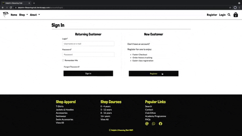
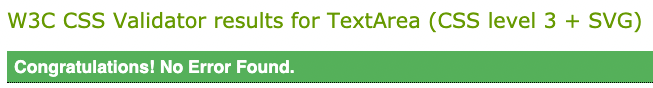
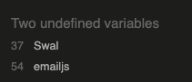
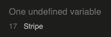
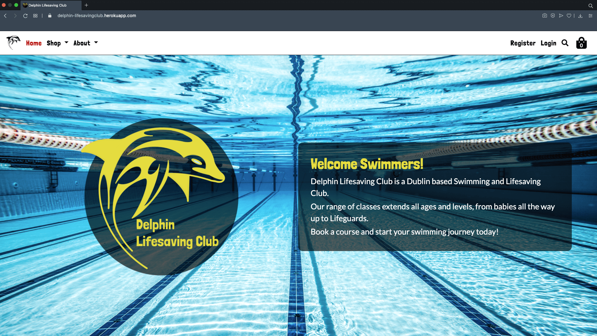

<div align='center'>

<h1> TESTING.md </h1>
</div>

[Return to README.md file](README.md "Link to README file")

[View live project](https://delphin-lifesavingclub.herokuapp.com/ "Link to Live project")

[View Repository](https://github.com/rebeccatraceyt/delphin_lifesavingclub "Link to Repository")

***

### Table of contents
1. [Testing User Stories](#Testing-User-Stories)
2. [Manual Testing](#Manual-Testing)
    1. [Common Elements Testing](#Common-Elements-Testing)
    2. [Page Elements Testing](#Page-Elements-Testing)
3. [Automated Testing](#Automated-Testing) 
     - [Code Validation](#Code-Validation)
     - [Browser Validation](#Browser-Validation)
     - [Lighthouse Auditing](#Lighthouse-Auditing)
4. [User Testing](#User-Testing)

***

<div align='center'>

</div>

***

## Testing User Stories

User stories were tested to ensure the needs of the user were being met, with the following results:

### General Users

| **1. As a user I want to view all products, to purchase my desired items.** |
|----------------------------------------------------------------------------|
- In the `Shop` dropdown menu on the navigation menu, users have the selection to `Shop Apparel`, `Shop Courses` or `View All`. 
- `View All` will direct users to the `All Products` page.
- There are breadcrumbs on both `All Apparel` and `All Courses` pages, allowing users quick access to the `All Product` page. 

| **2. As a user I want to filter through categories, to only see relevant products.** |
|----------------------------------------------------------------------------|
- On all `Shop` pages, there are filters for categories, and sub-categories. 
- The `All Products` page has the `Apparel` and `Courses` category button filters. 
- The `Apparel` and `Courses` pages have their respective sub-category button filters (apparel type and age range). 

| **3. As a user I want to use a search query, to find a specific product or product type.** |
|----------------------------------------------------------------------------|
- Users can use the category filters available on the `Shop` pages to quickly search for their product category. 
- There is a `Search` page, distinguished by a conventional search icon on the navigation menu, directing users to the search page, where they can type in their query. 

| **4. As a user I want to add items to my shopping bag, to begin the order process.** |
|----------------------------------------------------------------------------|
- On all product detail pages, there is a call-to-action button that allows users to add their desired product to their shopping bag. 
- The user will not be able to view items in their shopping bag if they are not authenticated. 

| **5. As a user I want to receive visual feedback that my item has been added to the bag, to confirm my selection.** |
|----------------------------------------------------------------------------|
- On clicking the `Add to Bag` button on the product detail page, a toast will provide feedback to the user that the product has been successfully added to their shopping bag. 
- To view their shopping bag they will have to login. 

| **6. As a user I want to select a course on a specific day, to suit my needs.** |
|----------------------------------------------------------------------------|
- Each course has their own specific class times and days. 
- The user is able to select their preferred time/day using the `select` dropdown menu on the product details page. 
- Each class provides information to the user of how many places are available for that particular class. 

| **7. As a user I want to select apparel in a specific size, to suit my needs.** |
|----------------------------------------------------------------------------|
- Similar to the courses, all apparel products have a selection of sizes available. 
- Users can select their size using the `select` dropdown menu. 
- Each product provides information of the the stock numbers to the user. 

| **8. As a user I want to view contact information for the club, to communicate with team.** |
|----------------------------------------------------------------------------|
- The `Contact` page is available in the `About` dropdown menu of the navigation menu. 
- Clicking it will direct users to the contact page, which provides multiple points of contact: 
    - Phone Number link 
    - Email address to notable Club Officers |
    - A map pinpointing the clubs location  
    - A Contact form for general enquiries  |

| **9. As a user I want to connect with the club on one of their social apps, to communicate with the team.** |
|----------------------------------------------------------------------------|
- On the footer (displayed on all pages, with the exception of the checkout pages) there are social links, providing quick access to the clubs social accounts:
    - Facebook
    - Whatsapp
    - Mailto

| **10. As a user I want to get a breakdown of classes offered, to find one that suits my needs.** |
|----------------------------------------------------------------------------|
- The `Academy Programme` page is located in the `About` dropdown list of the navigation menu.
- The page hosts an accordian feature with each class that the club offers housed in their own accordion, with the class name and age range as the title of each.
- Clicking their desired class will open the accordion, providing users with the necessary information about each.

| **11. As a user I want to navigate to a page that could help me with my enquiry, to answer my question.** |
|----------------------------------------------------------------------------|
- The `Frequently Asked Questions` page is located in the `About` dropdown list of the navigation menu.
- Similar to the Academy Programme page, the FAQs are displayed in a featured accordion, with each question as the title of the accordion card.
- Clicking the question opens the card, revealing the answer for the user.

### New Visitors

| **1. As a new visitor, I want to create an account, to unlock registered user features.** |
|----------------------------------------------------------------------------|
- If the user is not authenticated, two links will be displayed on the navigation menu:
    - `Register`
    - `Login`
- Register will lead users to the signup page, allowing the user to enter their details and create their account.
- The register page is also availble on the login page for convenience.

### Returning Visitors

| **1. As a returning visitor, I want to easily log into my existing account, to unlock registered user features.** |
|----------------------------------------------------------------------------|
- If the user is not authenticated, the login page will be clearly displayed on the navigation menu.
- Clicking it directs the user to the login page, where they can enter their details to log into their account.

| **2. As a returning visitor, I want to view my previous orders, to keep a record of my transaction.** |
|----------------------------------------------------------------------------|
- When a user is authenticated, a mew dropdown menu is displayed. The `Account` dropdown menu provides users with quick access to their order history.
- On the `Order History` page, the user will be presented with a table of their previous orders (if they have any) or conditional text.
- Each order displays the date of the order, the number of items and the grand total of the order.
- A call-to-action `View` button allows users to view the entire order details.

| **3. As a returning visitor, I want to save default information, to save time for future orders.** |
|----------------------------------------------------------------------------|
- On the `Account` dropdown menu, there is a quick link to the users profile page, there they can enter their default information for faster checkout.
- Additionally, the user can click the checkbox available on the checkout page to save their information.

| **4. As a returning visitor, I want to edit default information, to update any necessary fields.** |
|----------------------------------------------------------------------------|
- Directing to the user's profile page will display the user's saved default information.
- There they can edit their information, as needed, and click the call-to-action `Update` button.

| **5. As a returning visitor, I want to view shopping bag to get an overview of products I wish to order.** |
|----------------------------------------------------------------------------|
- When the user adds to their shopping bag, a toast will appear providing real-time information that the product was sucessfully added, as well as a snapshot of the contents currently in their bag.
- Clicking either the toast or the bag icon will direct the user to their shopping bag to view and edit as they wish.

| **6. As a returning visitor, I want to remove products from my bag, to suit my needs.** |
|----------------------------------------------------------------------------|
- In the shopping bag, there is a conventional `x` icon placed at the top-right of each product box.
- Clicking this item will remove the product from their shopping bag.

| **7. As a returning visitor, I want to update a product's quantity, to suit my needs.** |
|----------------------------------------------------------------------------|
- Within the shopping bag, the user can update the quantity of a particular product by using the prepending and appending buttons on the quantity box.
- They can then save their changes by clicking the call-to-action `Update` button.

| **8. As a returning visitor, I want to get real-time feedback on available stock, to make purchase decisions.** |
|----------------------------------------------------------------------------|
- Each product variation has it's own stock count displayed on the product details page.
- This provides users with real-time stock numbers, allowing them to select up that number.
- The buttons on the quantity box dynamically change, based on the stock count of the product selected and the quantity the user has inputted.

| **9. As a returning visitor, I want to proceed to a secure checkout, to make a purchase.** |
|----------------------------------------------------------------------------|
- In the shopping bag, a `Secure Checkout` button directs users to the first page of the checkout process.

| **10. As a returning visitor, I want to have clear visual feedback of the order process, to understand all steps of the process.** |
|----------------------------------------------------------------------------|
- Each step of the checkout process provides a Heads Up display of the checkout process. 
- This display changes page to page, with clear feedback to the user of their current location in the process.

| **11. As a returning visitor, I want to be able to edit my bag at all times, to allow change of mind.** |
|----------------------------------------------------------------------------|
- The user can edit their bag in the shopping bag.
- An Edit button is available on every page of the checkout process, allowing the users to return to their shopping bag for editing.

| **12. As a returning visitor, I want to receive a summary of my order via email to confirm that my transaction has been process.** |
|----------------------------------------------------------------------------|
- When a user successfully checks out, a confirmation email will be sent to their specified email address.
- This email will provide order information including the date, total and a list of ordered items.
- Further information, such as delivery times and course instructions are available in the email.

[Back to top ⇧](#table-of-contents)

***

## Manual Testing

### Common Elements Testing
Manual testing was conducted on the following elements that appear on every page:

- Clicking the Logo located on the top-left of the screen will redirect the user back to the **Home Page**:

    

- Hovering over the **Navigation Links** will trigger the hover effect, confirming the page the user is on:

    

- Collapsible `hamburger` button on mobile and tablet devices reveals **Navigation** menu:

    

- Navigational menu differs for authenticated and unauthenticated users:

    **Non-Registered User** <br />
    
 
    **Registered User** <br />
    

- Hovering over the **Footer** links will trigger the hover effect, confirming the action the user is about to take:
    
    

- Clicking the **Footer Social Icons** opens the social platform in a new tab:

    - **Facebook:** <br />
    

    - **WhatsApp:** <br />
    


### Page Elements Testing

#### Home Page

Manual testing was conducted on the following elements on the **Home** Page:

- Clicking the **Category Links**, directs the user to their desired location:

    

- Home Page Responsiveness:

    

#### All Products Page

Manual testing was conducted on the following elements on the **All Products** Page:

- Clicking the **Breadcrumb Links**, directs the user back:

    

- Clicking the **Category Filters** directs the user to their desired category:

    

- Clicking the **Products** directs users to the product's details page:

    **Product Image** <br />
    

    **Product Name** <br />
    

- Clicking the **Pagnination Links** directs users to the next page:

    

- All Products Page Responsiveness:

    

#### Apparel and Courses Pages

Manual testing was conducted on the following elements on the **Apparel and Courses** Page:

- Clicking the **Breadcrumb Links**, directs the user back:

    

- Clicking the **Sub-category Filters** directs the user to their desired category:

    

- Clicking the `information` icon on the Course page opens the Course Information modal:

    

- Apparel and Course Page Responsiveness:

    

#### Search Page

Manual testing was conducted on the following elements on the **Search** Page:

- Using the search bar, users will be provided with the appropriate response:

    **With Results** <br />
    

    **With No Results** <br />
    

- Clicking the **Search** title will reset the search:

    

- Clicking the **Category Buttons** directs the user to their desired category:

    

- Clicking the **Category Filters** directs the user to their desired category:

    

- Search Page Responsiveness:

    

#### Individual Product Page

Manual testing was conducted on the following elements on the **Individual Product** Page:

- Clicking the **Breadcrumb Links**, directs the user back:

    

- Clicking the **Dropdown** menu allows users to select their desired product variation (size or class time). providing stock count for each:

    

- Clicking the **Quantity Buttons** allows users to control their selected quantity:

    **Maximum** <br />
    

    **Minimum** <br />
    

- Clicking the `course information` link on Course pages opens the Course Information modal:

    

- Clicking the **Back Button** brings user to their previous page: 

    

- Clicking the **Add to Bag Button** adds the product to the user's bag, providing a toast for real-time feedback: 

    

- Individual Product Page Responsiveness:

    

#### Signup Page

Manual testing was conducted on the following elements on the **Signup** Page:

- Using the input field, the user can enter their details and click the **Signup** button, which directs the user to the verification page:

    

- Clicking the link provided in the email will invite the user to confirm their email:

    

- Signup Page Responsiveness:

    


#### Login Page

Manual testing was conducted on the following elements on the **Login** Page:

- Using the input field, the user can enter their login details and click the **Login** button, which directs the user to the Home page:

    

- Clicking the **Register Button** directs the user to the sign up page:

    

- Login Page Responsiveness:

    

#### Club Ethos Page

Manual testing was conducted on the following elements on the **Club Ethos** Page:

- Clicking the **External Links** opens a new tab:

    **SwimIreland** <br />
    

    **RLSS** <br />
    

- Club Ethos Page Responsiveness:

    

#### Academy Programme Page

Manual testing was conducted on the following elements on the **Academy Programme** Page:

- Clicking the accordion titles opens the accordions, displaying information:

    

- Clicking **Hide/Show** all allows user control of the page:

    

- Academy Programme Page Responsiveness:

    

#### FAQs Page

Manual testing was conducted on the following elements on the **FAQs** Page:

- Clicking the accordion titles opens the accordions, displaying information:

    

- Clicking **Hide/Show** all allows user control of the page:

    

- FAQs Page Responsiveness:

    

#### Contact Page

Manual testing was conducted on the following elements on the **Contact** Page:

- Clicking the **Embedded Google Maps** allows the user to control the map:

    

- Sending a message on the contact form, provides real-time feedback to the user:

    

- Contact Page Responsiveness:

    

#### Shopping Bag Page

Manual testing was conducted on the following elements on the **Shopping Bag** Page:

- Clicking the **Breadcrumb Links**, directs the user back to the home page:

    

- Clicking the **Keep Shopping** button returns user to the All Products page:

    

- Clicking the `x` button removes the product from the bag:

    

- Clicking the **Quantity Buttons** allows users to control their selected quantity:

    **Maximum** <br />
    

    **Minimum** <br />
    

- Clicking the **Update Button** updates the bag with the user's selected quantity:

    

- Clicking the **Checkout Button** brings the user to the order review page:

    

- Shopping Bag Page Responsiveness:

    

#### Order Review Page

Manual testing was conducted on the following elements on the **Order Review** Page:

- Clicking the **Logo** returns the user to the shopping bag:

    

- Clicking **Return to Bag** returns the user to the shopping bag:

    

- Clicking the **Checkout Button** brings the user to the order details page:

    

- Order Review Page Responsiveness:

    

#### Order Details Page

Manual testing was conducted on the following elements on the **Order Details** Page:

- Clicking the **Logo** returns the user to the shopping bag:

    

- Clicking the **first circle** in the HUD returns the user to the Order Review page:

    

- Clicking **Edit Bag** returns the user to the shopping bag:

    

- On mobile devices, the order summary collapses for convienience:

    

- The input fields allow the user to enter their details and clicking the **Complete Order Button** brings the user to the order complete page:

    

- Order Details Page Responsiveness:

    

#### User Profile Page

Manual testing was conducted on the following elements on the **User Profile** Page:

- Clicking the **Buttons** allows the user to control the page:

    

- The input fields allow the user to enter their details and clicking **Update Information** saves the new default information:

    

- User Profile Page Responsiveness:

    

#### Past Orders Page

Manual testing was conducted on the following elements on the **Past Orders** Page:

- Clicking the **Buttons** allows the user to control the page:

    

- Clicking **View Bag** directs the user to their selected past order page:

    

- Past Orders Page Responsiveness:

    


[Back to top ⇧](#table-of-contents)

***

## Automated Testing

### Code Validation

- [W3C Markup Validator](https://validator.w3.org/ "Link to W3C Markup Validator") was used to validate the `HTML` code used, using the `Validate by URI` method.

    - `Duplicate ID` errors were highlighted on the `Academy Programme` and `FAQs` pages. These are due to the iteration of database data and could not be modified (attempts were made to dynamically change the id according to the object, but the developer was unsuccessful in implementing this).

    - `Duplicate ID` error for  `id_select` in product page is due to the iteration of `product_select` objects.
    
    - All other highlighted errors were resolved.

-  [W3C CSS Validator](https://jigsaw.w3.org/css-validator/ "Link to W3C CSS Validator") was used to validate the `CSS` code used with the following result:

    **Base CSS**<br />
    

    **Checkout CSS**<br />
    

    **Profile CSS**<br />
    


- [JSHint](https://jshint.com/ "Link to JSHint") was used to validate the `JavaScript` and `JQuery` code used.

    - Errors highlighted in `contact_email.js` pertain to [SweetAlert2](https://sweetalert2.github.io/ "Link to Sweet Alert 2 page") (used for contact form feedback) and [jQuery Validation](https://jqueryvalidation.org/ "Link to jQuery Validation page")(used for validating contact form):

        
    
    - Errors highlighted in `strip_elements.js` pertain to [Stripe](https://stripe.com/en-ie "Link to Stripe Homepage") import:

        

    - There were no errors highlighted in `profile.js` or `base.js` files

- [PEP8 Online](http://pep8online.com/ "Link to PEP8 Online") was used to validate `Python` code.

    - A `line too long` linting error was highlighted in `settings.py` within the `AUTH_PASSWORD_VALIDATORS` variable (required by AllAuth).

    - Working with their mentor, the devloper decided to ignore this error as the lines could not be broken down without losing necessary password validation functionality, using the the [Flake8 Ignoring Violations](https://flake8.pycqa.org/en/latest/user/violations.html#in-line-ignoring-errors "Link to Flake8 docs") comment `# noqa`, with the final code as:

        ```
        AUTH_PASSWORD_VALIDATORS = [
            {
                'NAME': 'django.contrib.auth.password_validation.UserAttributeSimilarityValidator',  # noqa
            },
            {
                'NAME': 'django.contrib.auth.password_validation.MinimumLengthValidator',  # noqa
            },
            {
                'NAME': 'django.contrib.auth.password_validation.CommonPasswordValidator',  # noqa
            },
            {
                'NAME': 'django.contrib.auth.password_validation.NumericPasswordValidator',  # noqa
            },
        ]
        ```

    - All other highlighted errors and warnings were resolved.

### Browser Validation
**Chrome:**


**Safari:**


**Edge:**


**Opera:**



**Firefox:**


### Lighthouse Auditing

#### Desktop
| Page | Performance | Accessibility | Best Practice | SEO |
|------|:-------------:|:---------------:|:---------------:|:-----:|
| Home Page | 70% | 91% | 93% | 100% |
| Shop Pages | 73% | 91% | 100% | 100% |
| Login | 98% | 92% | 100% | 100% |
| Register | 98% | 92% | 100% | 100% |
| Search | 85% | 92% | 100% | 100% |
| Ethos Page | 95% | 91% | 87% | 100% |
| Academy Programme | 88% | 90% | 100% | 96% |
| FAQs | 98% | 90% | 100% | 100% |
| Contact | 98% | 90% | 93% | 100% |
| My Profile | 97% | 92% | 100% | 100% |
| Order History | 97% | 91% | 100% | 100% |
| Shopping Bag | 85% | 78% | 100% | 100% |
| Review Order Page | 81% | 91% | 100% | 100% |
| Order Details Page | 89% | 94% | 100% | 100% |
| Order Complete Page | 94% | 90% | 93% | 100% |

#### Mobile
| Page | Performance | Accessibility | Best Practice | SEO |
|------|:-------------:|:---------------:|:---------------:|:-----:|
| Home Page | 73% | 88% | 100% | 95% |
| Shop Pages | 65% | 88% | 100% | 97% |
| Login | 89% | 92% | 100% | 94% |
| Register | 92% | 89% | 100% | 94% |
| Search | 70% | 92% | 100% | 95% |
| Ethos Page | 89% | 88% | 97% | 93% |
| Academy Programme | 95% | 91% | 87% | 100% |
| FAQs | 88% | 86% | 100% | 96% |
| Contact | 89% | 87% | 93% | 94% |
| My Profile | 85% | 92% | 100% | 95% |
| Order History | 82% | 88% | 100% | 96% |
| Shopping Bag | 74% | 71% | 100% | 94% |
| Review Order Page | 79% | 91% | 100% | 100% |
| Order Details Page | 72% | 96% | 100% | 100% |
| Order Complete Page | 89% | 87% | 93% | 93% |

#### Breakdown of Results

| Error / Warning | Comment |
|:---------------:|:-------|
| Reduce unused JavaScript | This was pertaining to the jQuery minified link. |
| Reduce unused CSS | This was pertaining to the Boostrap minified link. |
| Use HTTP/2 | The developer chose not to use HTTP/2 as it required additional support for functionality. |
| Logo image does not specify `width` and `height` | The developer tried to correct this, but specifying these attributes caused a clash with other bootstrap classes, resulting in sizing issues. |
| Links to cross-origin destinations are unsafe | This was recified by implementing the `rel="noopener"` attribute to external links. |
| ARIA IDs are not unique | This was cause by the navbar and accordion menus. The #navbarDropdown ID was changed to a more specific ID for each category. The #programmeCollapse and #questionCollapse ID's pertain to the Jinja for loop used to iterate through the content and could not be changed. |
| Missing accessibility name for input fields | This was recified by using the Bootstrap `.sr-only` class on a label.|
| Text not appropriately sized | This highlighted that the footer text was too small, which was then rectified. |
| Links do not have a discernible name | This was the `mailto` button on the footer. An `aria-label` was used to fix this. |

[Back to top ⇧](#table-of-contents)

***

## User testing 
Family members and friends were asked to review the site and documentation to point out any bugs and/or user experience issues. Their helpful advice throughout the process led to many UX changes in order to create a better experience. 

It was through this testing that the following changes were made:
| Update | Comments |
|-----------------------|----------|
| Update to the navigation mobile menu | Originally, all links were displayed on the navbar on mobile and tablet devices, but this was quickly changed as it was noted that the menu was too long and not user-friendly. |
| Button style update | Button and anchor links were re-styled to be more consistent in their look and behaviour throughout the site, creating a positive user experience. |
| Divide of categories | Originally, there were only two category filter buttons on the `Home`, `Shopping Bag` and `Search` pages. It was recommended in the early testing stages to include all types of categories, to allow users a more refined experience, as well as removing the dead white space surrounding them. |

[Back to top ⇧](#table-of-contents)

***